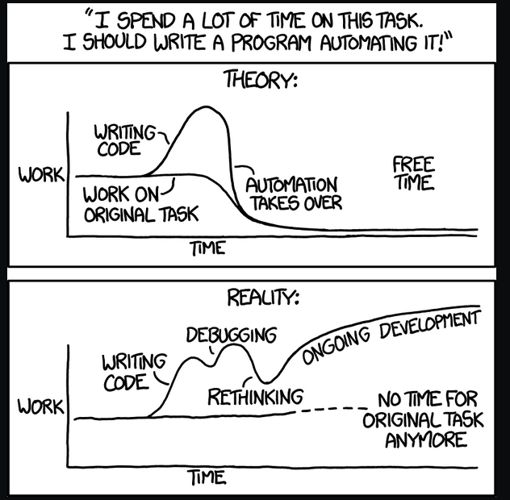

**How to log into ieng6 for only Connor Pitts.**


# Install VS Codium:


* Open terminal: 

 * ```sudo snap install codium --classic```

 * Or go to the website [VS Codium](https://vscodium.com/)


# Connecting Online: 

 ```$ ssh cse15lwi22aqm@ieng6.ucsd.edu```

And you're in!  Or you should be if you haven't deleted the public key in your computer currently! (If you did check out the SSH Keys part)


You can try some commands to make sure it works, but that's pretty boring, as it's the same as any terminal. 


# I want new files!!!!  (Or how to move files using scp)

```$ scp InsertFileName.java cs15lwi22aqm@ieng6.ucsd.edu:~/```


# I'm an idiot and deleted my public keys (SSH Keys)

on client (your computer)

```$ ssh-keygen (generates some keys for you)```

Enter file in which to save the key (/Users/connor/.ssh/id_rsa): /Users/connor/.ssh/id_rsa

Enter passphrase (empty for no passphrase): 

Enter same passphrase again: 

Your identification has been saved in /Users/connor/.ssh/id_rsa.

Your public key has been saved in /Users/connor/.ssh/id_rsa.pub. 
(NOTE THE PUBLIC, choose the public file)

The key fingerprint is:

insert-string-of-random-letters-and-a-weird-image-here

Now copy to the user account on the server

```$ ssh cs15lwi22aqm@ieng6.ucsd.edu```

password here

I'm in! (now on server)

```$ mkdir .ssh```

$ <logout>

On computer (client)

```$ scp /Users/jconnor/.ssh/id_rsa.pub cs15lwi22aqm@ieng6.ucsd.edu:~/```

.ssh/authorized_keys

Then sign in.


# Optimize remote sign in.


## Bash! Bash! Bash!

*Set up a bash script

*```touch SaveTime``` 

*Put any keystrokes or commands you with to run.

*```Echo ssh cs151wi22aqm@ieng6.ucds.edu```
* Set command under RedDragon software package to run the bash command when button 3 is pressed. 
* Then add automation to to hit enter 
* Press button 3 on mouse and it runs!
* One click sign in.  Magic!




