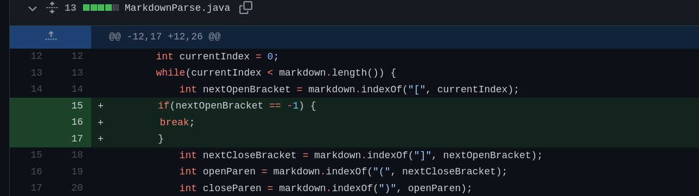
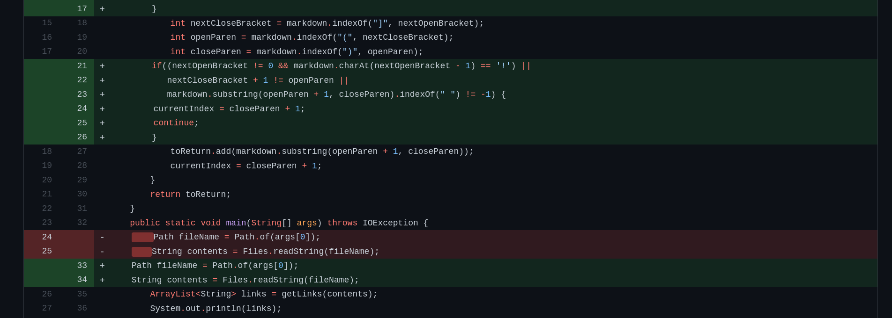
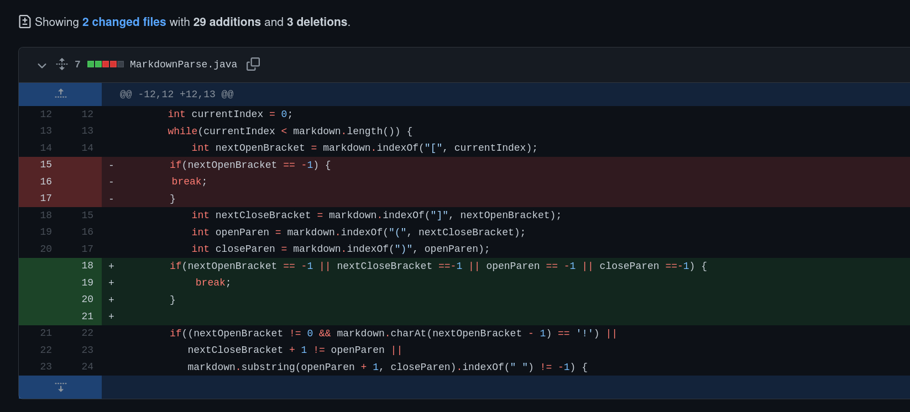

# Lab Report 2


## Bug/Fix 1


* [Test File](https://github.com/Pitts-Connor/markdown-parse/blob/main/test3.md)
* ```connor@connor-Laptop:~/Documents/GitHub/markdown-parse$ java MarkdownParse test3.md```
* ```[but it does have parentheses]```
* <p>This test make it check whether or not there is an opening bracket to even start the test.  Without it, it would just return anything in paranthases, even when if it had no brackets.   

## Bug/Fix 2


* [Test File](https://github.com/Pitts-Connor/markdown-parse/blob/main/test2.md)
* ```connor@connor-Laptop:~/Documents/GitHub/markdown-parse$ java MarkdownParse test2.md```
* ```[https://kde.org]```
* <p>This code took the exclamation point in decription of the duckduckgo website means that it is an image and not a link.  This then made it so the duckduckgo website wouldn't be printed.  </p>


## Bug/Fix 3


* [Test File](https://github.com/Pitts-Connor/markdown-parse/blob/main/test5.md)

* ```connor@connor-Laptop:~/Documents/GitHub/markdown-parse$ java MarkdownParse test5.md```

* <p>This test ran for an infinite loop.  That is why the command line here is so short.  It would search forever looking for a closed parantheses when there was none.  Adding something to check for that and break the loop fixed this problem </p>
