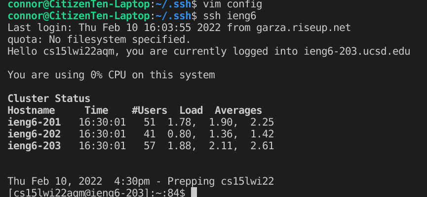

# File Report 3

## Streamlining ssh Configuration

* First you create a file by going to vim and typing in:

* ```vim config```

* Then copy and paste the proper code with your username:


* Then run the code 



* It works!!