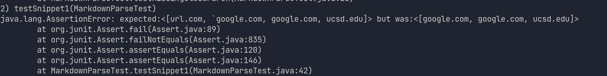

# Lab Report Week 4

## Snippet 1

* My Code Test:
 
* My Code Result:

* My test failed because of the backticks in the test.  I think there is a pretty simple solution to it, and it's the same as the other ways you take out brackets and such.  Just check the code for any backticks and if there are any, 
