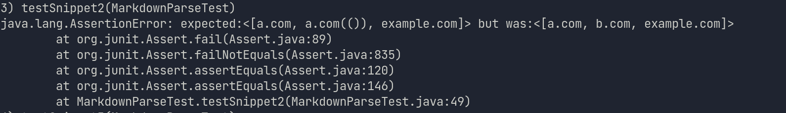

# Lab Report Week 4

## Github Links:
* https://github.com/Pitts-Connor/markdown-parse.git
* https://github.com/ucsd-cse15l-w22/markdown-parse.git

## Snippet 1

* My Code Test:
 
* My Code Result:

* Reviewed Implementation Test:
 
 * Reviewed Implementation Code:
  

* Both tests failed in the exact same way. The solulion to fixing this would probably be pretty easy as it is not allowed for one to have backslashes in url's so the code could just safely take it out.  

## Snippet 2
* My Code Test:
 
* My Code Result:

* Reviewed Implementation Test:
 
 * Reviewed Implementation Code:
  

* Both tests failed once again in the same fashion. This one is another one where I think there is a 10 line solution and it would be to just check for nest brackets, paranthasese and escaped brackets via a few if statements.    

## Snippet 3
* My Code Test:
 
* My Code Result:

* Reviewed Implementation Test:
 
 * Reviewed Implementation Code:
  
  *This one did not fail in the same way at all.  In the first, it printed nothing as it figured it was finished and stopped looking.  In the second, it ran out of range ofthe string it was to long.  I don't think there is a simple 10 line code change here, as to fix my code, you would need to change the entire logic of my code setup.  And for the immplementation, it would also be the case as it wasn't built to take such long values.   
